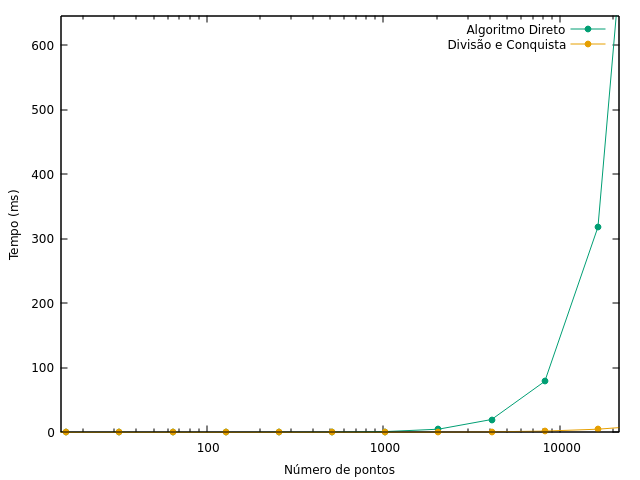
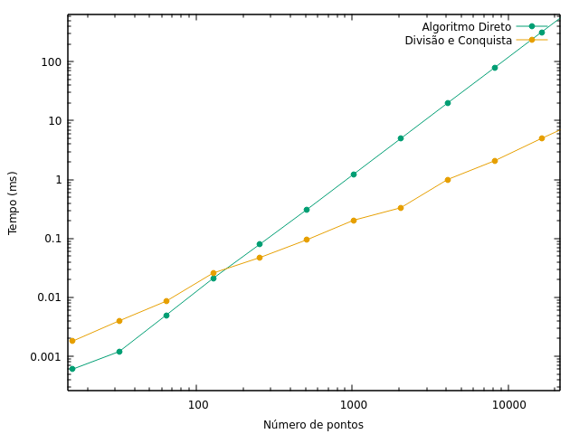
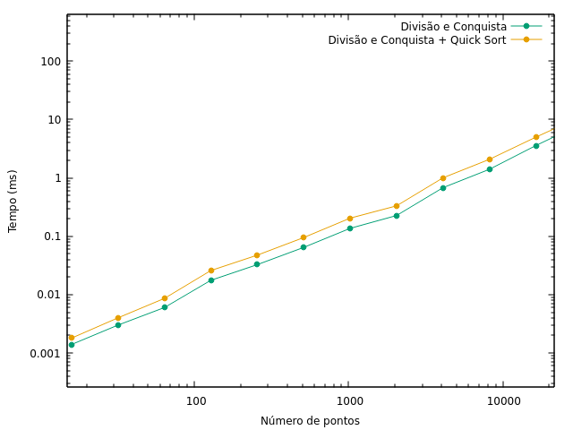

# Introdução
Este experimento tem objetivo de comparar o comportamento de dois algoritmos que 
possuem o mesmo fim: encontrar o par mais próximo dentre um grupo de pontos.
São estes o algoritmo iterativo e o algoritmo por divisão e conquista.

# O experimento
- Obter 5 conjuntos de pontos para cada N, sendo N o número de pontos do conjunto
- N parte de 2<sup>1</sup> até 2<sup>15</sup>, dobrando a cada passo
- Medir o tempo gasto para que cada algoritmo termine, sendo os dois algoritmos e o Quick Sort. 
Sendo os dois primeiros implementados na linguagem C e Quick Sort a função declarada em _stdlib.h_.
- Realizar a análise dos resultados e verificar se a eficiência do algoritmo de 
divisão e conquista na prática condiz com a teoria
# Algoritmo Direto
## Pseudocódigo
```
FUNCAO par_mais_proximo(pontos)
  delta = INFINITO
  PARA i DE 0 ATÉ tamanho(pontos)                                             -> O(n)
    PARA j de i + 1 ATÉ tamanho(pontos)                                       -> O(n/2)
      delta = minimo(delta, distancia(pontos[i], pontos[j]))
  RETORNE delta
```

## Complexidade
T(n) = O(n) * O(n/2)
T(n) = O(n^2)

# Divisão e Conquista
## Pseudocódigo
```
FUNCAO divisao_e_conquista(pontos)
  SE tamanho(pontos) == 3
    RETORNE par_mais_proximo(pontos)

  delta_esquerdo = divisao_e_conquista(primeira metade de pontos)             -> T(n/2)
  delta_direito = divisao_e_conquista(segunda metade de pontos)               -> T(n/2)

  delta = minimo(delta_esquerdo, delta_direito)
  ponto_meio = pontos[tamanho(pontos) / 2]

  meio = pontos com x entre (ponto_meio.x - delta) e (ponto_meio.x + delta)   -> O(n)
  ordena_por_y(meio)                                                          -> O(nlogn)

  PARA i DE 0 ATÉ tamanho(pontos)                                             -> O(n)
    j = i + 1
    ENQUANTO j < tamanho(pontos) E pontos[j].y - pontos[i].y < delta          -> O(7)
      delta = minimo(delta, distancia(pontos[j], pontos[i]))
      j = j + 1

  RETORNE delta
```

## Complexidade
T(n) = T(n/2) + T(n/2) + O(n) + O(nlogn) + O(n) * O(7)
T(n) = 2T(n/2) + O(nlogn)
T(n) = O(n(logn)^2)

# Resultados
| Número de Pontos | Método Direto | Divisão e Conquista | Quick Sort | D&C + QS |
|------------------|---------------|---------------------|------------|----------|
| 2^4              | 0.0006        | 0.0014              | 0.0004     | 0.0018   |
| 2^5              | 0.0012        | 0.0030              | 0.0010     | 0.0040   |
| 2^6              | 0.0050        | 0.0060              | 0.0026     | 0.0086   |
| 2^7              | 0.0210        | 0.0176              | 0.0082     | 0.0258   |
| 2^8              | 0.0800        | 0.0326              | 0.0148     | 0.0474   |
| 2^9              | 0.3092        | 0.0642              | 0.0306     | 0.0948   |
| 2^10             | 1.2390        | 0.1364              | 0.0676     | 0.2040   |
| 2^11             | 4.9614        | 0.2262              | 0.1054     | 0.3316   |
| 2^12             | 19.9204       | 0.6792              | 0.3222     | 1.0014   |
| 2^13             | 79.1688       | 1.4032              | 0.6726     | 2.0758   |
| 2^14             | 317.9352      | 3.5794              | 1.4138     | 4.9932   |
| 2^15             | 1270.9962     | 8.5888              | 2.9218     | 11.5106  |

## Algoritmo Direto x Divisão e Conquista


## Algoritmo Direto x Divisão e Conquista (log)


## Impacto do Quick Sort na Divisão e Conquista



# Conclusão
Considerando os resultados obtidos, é possível observar que conforme 
dobra o número de pontos, o crescimento de tempo do Método Direto é de
em média 400%, enquanto que a Divisão e Conquista tem variação de 225%. Tais valores seguem em linha com a complexidade dos respectivos algoritmos.

# Referências

https://www.youtube.com/watch?v=6u_hWxbOc7E
https://www.youtube.com/watch?v=vS4Zn1a9KUc
https://www.geeksforgeeks.org/closest-pair-of-points-using-divide-and-conquer-algorithm/